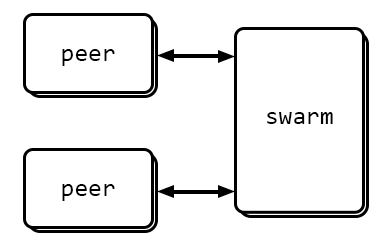
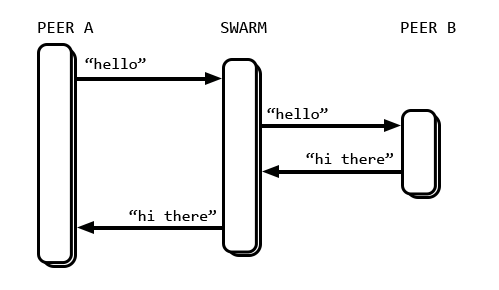
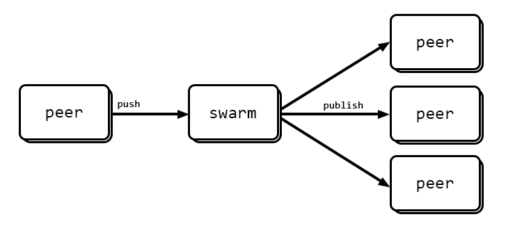

# Chat


An illustration of a *human-to-human* instant messaging application, made to explore the possibility of whether or not a similar approach can be taken in the design of *computer-to-computer* messaging.

> Messaging systems work basically as instant messaging for applications. - http://aosabook.org/en/zeromq.html

> Instant messaging for Apps - http://jaxenter.com/an-introduction-to-scriptable-sockets-with-zeromq-49167.html

# Architecture



Peers communicate via a broker called Swarm that delegates requests to one or more peers. The destination of each request is specified by each peer prior to making the request.

```json
{
	"recipients": ["markus", "nikki"]
}
```

### Message distribution



In a typical human-to-human messaging setup, one message may be received by one or more peers. The swarm "pulls" messages from each connected peer and publishes them to the recipient as specified by the transmitting peer. The same is true here. Each peer then discards messages received that isn't addressed to him.

The typical outgoing message could look like this: "Hello" whereas the typical incoming messages might look like this "World!".

As the examples is tailored for service requests, a peer may also send "order coffee latte --no-milk" to which the swarm will delegate this request to a peer capable of executing it. The incoming message in this case is a receipt of the order that the peer may use to query about the order just made.

### Terminology

* `PEER` - A human/computer connected to `SWARM` (synonyms: client)
* `SWARM` - Communication bus for all `PEERS` (synonyms: hub, bus, tracker)
* `WORKER` - Superset of `PEER`, typically a computer.
* `SERVICE` - Atomic unit of work.
* `TASK` - One or more `SERVICES` in progress.
* `LOGGER` - A record-keeping `WORKER`.

### Fire-and-forget

PEER send messages as "fire-and-forget". For any query, results are returned via the same channel as LETTERS; the opposite being Request/Reply or a RPC, in which the called expects a result immediately.

SWARM receives messages via a pull-mechanism and publishes messages to their respective recipient(s).

### Protocol

A message sent across the wire is called an `ENVELOPE` and has the following layout:

```json
{
    "type": MESSAGE_TYPE,
    "author": AUTHOR,
    "recipients": TARGET_AUTHORS,
    "payload": RAW_DATA,
    "timestamp": TIME_OF_TRANSMISSION
}
```

Each message transports exactly one (1) `PAYLOAD` which is the main reason for a message to exist; the other being to signal an event.

### Payload

Possible Payloads are:

- `Instant message` (str)
- `Peers` (list)
- `Order` (list) returns `OrderId`
- `OrderId` (int)
- `Query` (dict) returns `Query Results`
- `Query Results` (dict)

### Requirements

Project is developed by the following requirements; strike-through meaning "done".

* ~~`REQ01`~~ `PEER` may recieve `LETTERS`
* ~~`REQ02`~~ `PEER` may send `LETTERS`
* ~~`REQ03`~~ `PEER` may join late
* ~~`REQ04`~~ `PEER` may list remote peer's `SERVICES`
* ~~`REQ05`~~ `PEER` may list `SWARM` `SERVICES`
* ~~`REQ06`~~ `PEER` may list available `PEERS`
* ~~`REQ07`~~ `PEER` may list all `PEERS`
* `REQ08` `PEER` may signal availability (yes/no)
* `REQ09` `PEER` may signal inactivity (yes/no)
* ~~`REQ10`~~ There may be multiple `PEERS` in a `SWARM`
* `REQ11` One peer may send `LETTERS` to exactly one peer
* ~~`REQ12`~~ One peer may send `LETTERS` to multiple `PEERS`
* ~~`REQ13`~~ `PEER` may initiate conversation
* ~~`REQ14`~~ `PEER` may request status of running `SERVICE`
* `REQ15` There may be multiple `PEERS` with similar `SERVICES`
* `REQ16` `TASK` may be distributed across multiple available `PEERS`
* `REQ17` `PEER` may list running `TASKS`
* `REQ18` `PEER` may cancel a running `TASK`
* `REQ19` `WORKER` may run multiple `TASKS`
* `REQ20` `WORKER` may limit the amount of concurrent `TASKS`
* `REQ21` `WORKER` may signal statistics
* `REQ22` `LOGGER` maintains a record of all activitiy
* ~~`REQ23`~~ `PEER` may receive `LETTER` from previously unknown `PEER`

# Requirement Definitions

#### `REQ01` `REQ02` Send/receive 

Once a `PEER` is connected to a `SWARM`, route `LETTERS` to the designated `PEER`.

#### `REQ03` Join late 

`PEERS` not immediately available (late joiners) will receive `LETTERS` once available. This goes both ways; an active `PEER` may send `LETTERS` to an inactive `PEER` and an inactive `PEER` may deliver `LETTERS` sent previously to an active `PEER`

This involves:

* `SWARM` keeps track of `LETTERS` sent to any particular peer (a queue).
* Each letter contains a `delivered` and `timestap` property.
* Messages that has been `delivered` are removed from queue.

#### `REQ04` List `PEER` `SERVICES`

Involves returning upon query a list of available `SERVICES` that a remote computer may perform.

* Order coffee
* Publish file
* Compute algorithm

#### `REQ05` List `SWARM` `SERVICES`

Which smilies can I send to my `PEER`?

#### `REQ06` List available `PEERS`

Return a list of all `PEERS` currently connected to the `SWARM`. This includes the `SWARM` maintaining a record of each connected `PEER` and also governs how `PEERS` communicate; whether it be centrally (router pattern) or decentrally (freelancer pattern).

#### `REQ07` List all `PEERS`

Return list of all `PEERS` ever connected to the `SWARM`. Involves `SWARM` maintaining a persistent record of each connected client.

#### `REQ09` `REQ10` Status

A `PEER` may signal that he is either active or inactive. The `SWARM` is responsible for determining whether a `PEER` is available or not (indirectly, via his response to heartbeats).

#### Multiple `PEERS`

Multiple `PEERS` may exist providing similar services, such as taking orders, publishing files or converting images.

When a `PEER` requests services from one of many `PEERS`, each request will get distributes across all available `PEERS`.

#### Encapsulation of `SERVICES` into `TASK

A `WORKER` provides an interface to one or more services; called `TASK`.

#### Signalling availability

A `PEER` may request `SWARM` to provide a list of currently available `WORKERS`. Each `WORKER` then MUST provide the ability to respond to availability-queries.

This is how things may go down:
	1. `PEER` requests a `TASK` to be performed.
	2. `SWARM` receives request.
	3. `SWARM` requests one available `WORKER`
	4. `WORKER` is assigned the `TASK`

The requesting of available workers may go down like this:
	Scenario: 4 `WORKERS` are connected to `SWARM`, 2 of which are busy.
	1. Send availability-query to first `WORKER`
	2. If available; stop
	3. Else send to next `WORKER`, and so forth until found
	4. If none found, queue request and retry later.

In this scenario, the `SWARM` handles queuing of requests until a `WORKER` is available to accept.

#### Advanced signalling of availability

In cases where the request is more involved, a query may involve additional parameters:
	- `CORES` required
	- `MEMORY` required
	- `SOFTWARE` required
	- `PRIORITY` of request

To which availability may be returned with additional data:
	- Tasks remaining
	- Estimated time until available

In the case of multiple tasks already being present in `WORKER`, `PRIORITY` will determine in which position the new `TASK` will be placed.

- 1 will put it in front to be executed as soon as the current `TASK` is completed.
- 2 will position it in the center of the queue.
- 3 will append it to the end of the queue.

#### Statistics

A `WORKER` may return available CPU and `MEMORY`.